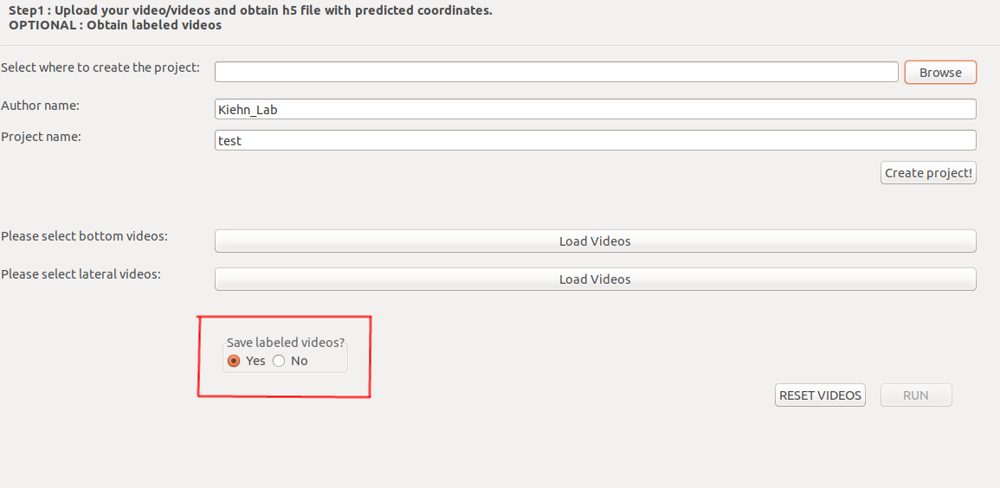

# Welcome to KiehnLab Locomotion Analysis tool.
This tool is designed to analyse bottom and lateral videos. Analysis for bottom videos include speed, acceleration and cadence profiles. For lateral videos, we provide stick plots and angles analysis between different joints. The pose estimation is performed by DeepLabCut.

# MANUAL #

## Let's start with turning on the tool:

1. Start by loading the appropriate conda environment. You do this by typing in 'conda activate DLC-CPU'
2. Go into the directory in which "gait_analysis" tool is located.
3. Start up the tool by typing 'python -m gait_analysis'

You will land on the main page of our tool. From here you can decide if you wish to start a new project, load an existing one or just perform a group analysis. 

**IMPORTANT!!!**
In order to load a project, it must be structured (files names) in a way that our tool does it. This is imperative for the tool to work properly. The structure of a project directory looks like that: 

Additionally, you can select which type of video you wish to analyse. The tool provides an option to either:
* only analyse bottom videos
* only analyse lateral videos
* analyse noth types of videos at the same time

**IMPORTANT!!!**

The tool makes a distinction between bottom and lateral videos based on the names of the file. Therefore it is crucial to keep a partical nomenclature. The difference for the corresponding bottom and lateral videos lies in the 'SIDEVIEW' prefix in the name of file.
Example:
* Bottom video filename:           Cage1_0L0R_20cms_0degUP_4.avi
* Lateral video filename: SIDEVIEW_Cage1_0L0R_20cms_0degUP_4.avi

## STARTING A NEW PROJECT

The following demo shows the case where one selects to analyse combined videos. The same applies to all other options however this is the most general version.

If you decide to start a new project, the first thing to do is to specify where we want to create it. Simply press the 'Browse' button and select a directory in which new project should be created. Next you need to set the 'Project name' and 'Author name'. The full name of the project folder will comprise of the project name, author name and current date. 
Example:

Such parameters will create a project named 'Kiehn_Lab-test-2021-04-14'. In case where you already a project withthat name, the program will ask you if you whish to overwrite already existing project. BE CAREFUL WITH THIS!

In the next step you need to upload the video which are to be analysed. It is important to upload correct videos under specific name, therefore under 'bottom videos' upload bottom videos and the same for lateral. If by any chance you upload wrong videos do not worry! Simply press a 'RESET VIDEOS' button which will reset all uploaded videos and you can repeat the process.

Finally, you have an optional choice do save labeled videos with overlayed markers on the analysed videos. This option serves only visualisation purpose, where you can make sure, that the model predicted correctly. 

In order to start the analysis press the 'RUN' button. A window will pop up telling how long the analysis is taking. When it disapears, this means that the analysis is finished. Corresponding labels will be save in a directory called 'Labels'. 

**IMPORTANT!!!**

In case of loading an existing project, this step is ommited!!!

## SPEED, ACCELERATION AND CADENCE PROFILES

